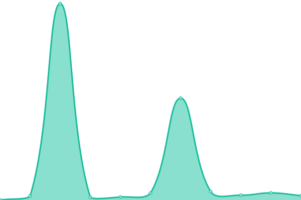

# [📈 Live Status](https://status.spschweiz.ch): <!--live status--> **Alle Systeme laufen störungsfrei.**

This repository contains the open-source uptime monitor and status page for [SP Schweiz](https://status.spschweiz.ch), powered by [Upptime](https://github.com/upptime/upptime).

With [Upptime](https://upptime.js.org), you can get your own unlimited and free uptime monitor and status page, powered entirely by a GitHub repository. We use [Issues](https://github.com/spschweiz/status/issues) as incident reports, [Actions](https://github.com/spschweiz/status/actions) as uptime monitors, and [Pages](https://status.spschweiz.ch) for the status page.

<!--start: status pages-->
<!-- This summary is generated by Upptime (https://github.com/upptime/upptime) -->
<!-- Do not edit this manually, your changes will be overwritten -->
<!-- prettier-ignore -->
| URL | Status | Geschichte | Antwortzeit | Gesamtverfügbarkeit |
| --- | ------ | ------- | ------------- | ------ |
|  [SP Schweiz-Webseite](https://www.sp-ps.ch) | verfügbar | [sp-schweiz-webseite.yml](https://github.com/spschweiz/status/commits/HEAD/history/sp-schweiz-webseite.yml) | 

 135ms
     
 | 

<a href="https://status.spschweiz.ch/history/sp-schweiz-webseite">100.00%</a>
    

|  [Wordpress-Plattform](https://sp-parl.ch) | verfügbar | [wordpress-plattform.yml](https://github.com/spschweiz/status/commits/HEAD/history/wordpress-plattform.yml) | 

 1046ms
     
 | 

<a href="https://status.spschweiz.ch/history/wordpress-plattform">66.90%</a>
    

|  [Mitgliederdatenbank](https://login.sp-ps.ch/tocco) | verfügbar | [mitgliederdatenbank.yml](https://github.com/spschweiz/status/commits/HEAD/history/mitgliederdatenbank.yml) | 

 778ms
     
 | 

<a href="https://status.spschweiz.ch/history/mitgliederdatenbank">100.00%</a>
    

|  [Sektionsportal](https://login.sp-ps.ch/) | verfügbar | [sektionsportal.yml](https://github.com/spschweiz/status/commits/HEAD/history/sektionsportal.yml) | 

 206ms
     
 | 

<a href="https://status.spschweiz.ch/history/sektionsportal">100.00%</a>
    

|  Mobilisierungstool Avanti | verfügbar | [mobilisierungstool-avanti.yml](https://github.com/spschweiz/status/commits/HEAD/history/mobilisierungstool-avanti.yml) | 

 389ms
     
 | 

<a href="https://status.spschweiz.ch/history/mobilisierungstool-avanti">100.00%</a>
    

|  [Mattermost Chat](https://mattermost.sp-ps.ch) | verfügbar | [mattermost-chat.yml](https://github.com/spschweiz/status/commits/HEAD/history/mattermost-chat.yml) | 

 365ms
     
 | 

<a href="https://status.spschweiz.ch/history/mattermost-chat">100.00%</a>
    

|  Jitsi Meet SP Schweiz | verfügbar | [jitsi-meet-sp-schweiz.yml](https://github.com/spschweiz/status/commits/HEAD/history/jitsi-meet-sp-schweiz.yml) | 

 581ms
     
 | 

<a href="https://status.spschweiz.ch/history/jitsi-meet-sp-schweiz">100.00%</a>
    

|  Telefonanlage | verfügbar | [telefonanlage.yml](https://github.com/spschweiz/status/commits/HEAD/history/telefonanlage.yml) | 

 471ms
     
 | 

<a href="https://status.spschweiz.ch/history/telefonanlage">100.00%</a>
    

|  Wissensdatenbank (Bücherregal) | verfügbar | [wissensdatenbank-buecherregal.yml](https://github.com/spschweiz/status/commits/HEAD/history/wissensdatenbank-buecherregal.yml) | 

 709ms
     
 | 

<a href="https://status.spschweiz.ch/history/wissensdatenbank-buecherregal">100.00%</a>
    

|  Terminalserver | verfügbar | [terminalserver.yml](https://github.com/spschweiz/status/commits/HEAD/history/terminalserver.yml) | 

 421ms
     
 | 

<a href="https://status.spschweiz.ch/history/terminalserver">100.00%</a>
    

|  Microsoft Exchange (Email, Kalender, Kontakte) | verfügbar | [microsoft-exchange-email-kalender-kontakte.yml](https://github.com/spschweiz/status/commits/HEAD/history/microsoft-exchange-email-kalender-kontakte.yml) | 

 1421ms
     
 | 

<a href="https://status.spschweiz.ch/history/microsoft-exchange-email-kalender-kontakte">100.00%</a>
    

<!--end: status pages-->

[**Visit our status website →**](https://status.spschweiz.ch)

## 📄 License

- Powered by: [Upptime](https://github.com/upptime/upptime)
- Code: [MIT](./LICENSE) © [SP Schweiz](https://status.spschweiz.ch)
- Data in the `./history` directory: [Open Database License](https://opendatacommons.org/licenses/odbl/1-0/)
